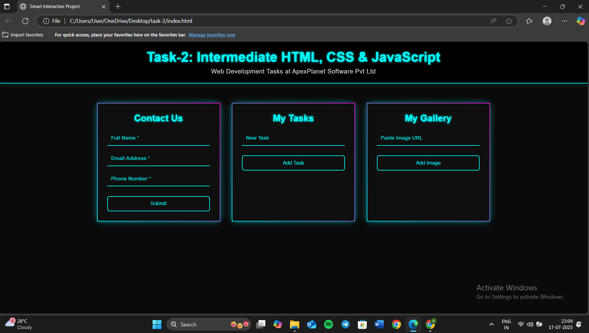

# ✅ Task 2 – Intermediate HTML, CSS, and JavaScript

This project is part of my ongoing web development training at **Apex Planet Pvt.Ltd.**  
It showcases my ability to build an interactive, responsive **Dynamic To-Do List , Contact Form and Image gallery** using core web technologies.

## 🎯 Objective
- Utilize **HTML** to structure a dynamic to-do list interface
- Style the app with **CSS**, including Flexbox & Grid for responsive design
- Implement **JavaScript** for form handling, input validation, and dynamic list updates

## 🧩 Features
- Add and remove tasks dynamically
- Input validation for task entry
- Clear button to reset task list
- Hover effects for better user interaction
- Fully responsive layout across devices

## 🔧 Technologies Used
- HTML
- CSS (Flexbox & Grid)
- JavaScript

## 📂 File Structure
- `index.html` — Main HTML page
- `style2.css` — CSS styles for layout and design
- `README.md` — Project documentation

## ▶️ How to Run
1. Clone or download this repository
2. Open `task2.html` in any modern browser
3. Interact with the to-do list — add, remove, and clear tasks

## 👩‍💻 Created By
**Bharti Johari**  
Intern @ Apex Planet Pvt.Ltd.  
BTech CSE (AI & ML) | Sanskriti University  
Frontend Development Learner & Enthusiast  

## 🌐 Live Demo
[Click here to see Live](https://bharti-johari.github.io/TASK-2-WEB-DEVELOPMENT/)

## 🖼️ Screenshot

